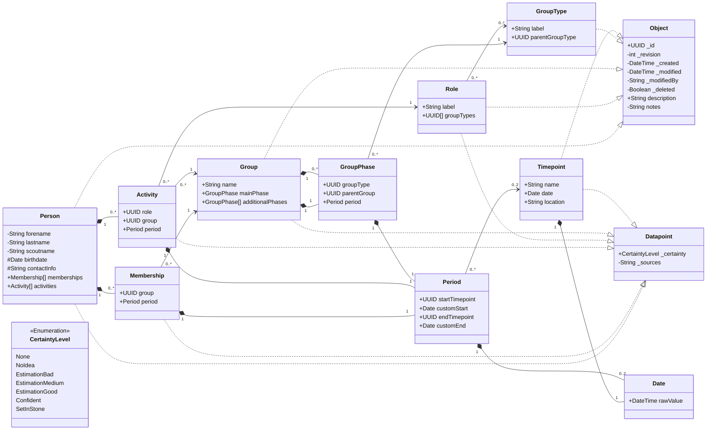

# Stammbaum der Vaganten

Web app for gathering, documenting, and exploring the history of [Stamm der Vaganten](http://stammdervaganten.de).

## Web App

- Plain HTML, CSS, JavaScript, and PHP 8.0+.
- Passkey authentication with optional one-time email login links.
- Permission-aware public, private, and protected fields.
- Human-readable JSON domain objects under `web/data/`.
- Private runtime state under `web/var/`.
- No Composer install, database, build step, or host-level config.

## Deploy

Upload the contents of `web/` to a PHP 8.0+ shared host and keep the included `.htaccess` files.\
Apache-compatible `.htaccess` support is needed for direct access protection.\

Configuration lives in `config/app.json`.\
Once editing is enabled, the app needs write access to `data/` and `var/`.\

Data timestamps stay in UTC; the configured timezone is only for frontend display.

## Auth

Login uses passkeys and optional email login links.\
Users, email addresses, and passkey public keys are stored in `var/auth/users.json`; setup tokens, login links, login challenges, and audit logs stay below `var/auth/`.
These files must not be web-readable.

For production, set a stable passkey relying-party configuration in `config/app.json`:
```json
{
  "auth": {
    "base_url": "https://stammbaumdervaganten.de",
    "rp_id": "stammbaumdervaganten.de",
    "origin": "https://stammbaumdervaganten.de",
    "allowed_hosts": [
      "stammbaumdervaganten.de"
    ],
    "trusted_proxies": [],
    "login_link_ttl_seconds": 600,
    "initial_admin_username": "admin"
  },
  "mail": {
    "enabled": true,
    "from_address": "noreply@stammbaumdervaganten.de",
    "from_name": "Stammbaum der Vaganten",
    "reply_to": "",
    "login_subject": "Login-Link für Stammbaum der Vaganten"
  }
}
```

Runtime filesystem permissions are set restrictively: directories use `0700` and
files use `0600` (subject to platform support; Windows ignores POSIX `chmod`).
Verify correct ownership and permissions on production.

Auth configuration is required and validated before auth storage or sessions initialize. `base_url` and `origin` must use HTTPS; `rp_id` and `allowed_hosts` must contain hostnames; `trusted_proxies` accepts only literal IP addresses. Keep local-development values in a separate local `config/app.json` rather than deriving them from request headers.
`base_url` is used for generated setup and login links.
Email login links are single-use, expire after `auth.login_link_ttl_seconds`, and are not re-sent while an earlier unused link is still valid.
Setup and email-login tokens are carried in URL fragments (`#setup=...` and `#login=...`). The browser removes the fragment immediately after copying the token into memory, so tokens are not sent in HTTP request targets.

Every request must use an `allowed_hosts` hostname. Plain HTTP is redirected with status `308` to the configured HTTPS `origin` while preserving a validated path and query. `X-Forwarded-Proto` is honored only when `REMOTE_ADDR` exactly matches a configured `trusted_proxies` IP; leave that list empty when Apache terminates TLS directly. Session cookies are always `Secure`, `HttpOnly`, `SameSite=Strict`, and scoped to `/`. HTTPS responses include one-year HSTS.

JSON API bodies are limited to 65,536 bytes in both PHP and Apache configuration. Authentication challenge counts and time-window request counters are stored atomically under `var/auth`; source IPs use forwarded headers only from configured trusted proxies.

Anonymous `status` responses expose only login availability and an empty auth identity. After login, the browser verifies that `config/app.json` is blocked, records the result under `var/auth/access_control_check.json`, reuses success for 24 hours, and shows a persistent warning when protection for `/app`, `/config`, `/data`, `/var`, or `/bootstrap_setup.txt` cannot be confirmed.

User sessions carry an `auth_epoch`; disabling a user, changing their email address, deleting them, or explicitly logging out all sessions invalidates existing sessions immediately. Login-link expiry normalization is shared by auth storage and mail wording. Security audit events include request correlation IDs and selected failures, but deliberately omit tokens, credential payloads, CSRF values, raw email addresses, user agents, source IPs, and genealogy data.

On first run with an empty `var/auth/users.json`, the app creates one admin account and writes a single-use setup URL to `web/bootstrap_setup.txt`.
Open that URL on the deployed site to register the initial passkey.

## Data Model

The app stores scout-group history as JSON objects.\
People, groups, roles, group types, and timepoints are independent objects linked by UUIDs.\
Memberships, activities, group phases, periods, and dates are embedded value objects.

Model goals:
- Keep domain data readable, diffable, and easy to repair.
- Preserve object history through revisions.
- Use stable UUID references instead of copied names.
- Model incomplete historical data with notes, sources, partial dates, and certainty values.



## Domain Rules

- A person can have memberships in groups and activities with roles.
- A membership links one person to one group for a period. An empty period
  means the entire lifetime of the group.
- An activity links one person, one group, and one role for a period. An empty
  period means the entire lifetime of the applicable group phase or phases.
- A group has one main phase and can have additional phases.
- A group phase references one group type for a required period. Unlike
  memberships and activities, phases define the group's lifetime and therefore
  have no outer period to inherit.
- A role can be restricted to group types; an empty `groupTypes` list means
  unrestricted.
- Period boundaries can use named timepoints or custom dates.
- Reverse views, such as all members of a group, are derived from memberships
  and activities.

## Visibility

- public (`+`): visible without login.
- private (`-`): visible to logged-in users with read access.
- protected (`#`): visible to logged-in users with the sensitive data permission.

## Storage

Each object class has one direct collection folder below `data/`, named as the class name plural in kebab-case and used as the REST resource collection.

Each JSON file in those folders represents one object and uses the object UUID as its filename:

```text
web/data/
  people/{uuid}.json
  groups/{uuid}.json
  group-types/{uuid}.json
  roles/{uuid}.json
  timepoints/{uuid}.json
```

Each object JSON contains the type's fields directly, including inherited base fields.\
Runtime state files (such as auth files, generated cache data, change queues, and locks) live under `web/var/`.

## Versioning And Concurrency

Updates change `_revision`; if the stored object changed in the meantime, the API returns `409 Conflict`.\
Previous versions are saved as `<id>_<revision>.json` before `<id>.json` is replaced.\
Deletes are soft deletes using `_deleted: true`.

Objects use optimistic concurrency for multi-user editing.

## Default Data

Default group types and roles are normal full UUID-backed objects.\
They are starting data and can be removed on a fresh install.

Group types:

- Stamm
- Meute
- Rudel
- Gilde
- Sippe
- Runde
- Kreis

Roles:

- Stammesführung
- Stellv. Stammesführung
- Kassenwart
- Stellv. Kassenwart*in
- Handkasse
- Meutenführung
- Meutenassistenz
- Rudelführung
- Sippenführung
- Gildensprecher*in
- Rundensprecher*in
- Kreisleitung

## Features

### Picker Logic

Reference pickers are select-only and use the current loaded object lists.\
Every picker has a clear option so dependent fields can become unrestricted again.\
Activity group and role pickers filter each other: a selected group limits roles to roles usable for that group's type, and a selected restricted role limits groups to matching group types.\
If a person birthdate is known, person group pickers hide groups that clearly ended before that birthdate.\
If a membership or activity period is known, group pickers hide groups that clearly do not overlap that period.\
Period timepoint pickers filter each other so starts stay before ends and ends stay after starts.\
Missing dates, missing group types, and unrestricted roles keep pickers broad instead of blocking selection.

## Current Gaps

- The main tree visualization is not implemented yet.
- Automated tests are still missing.
- Search, validation, import/export, duplicate handling, and source tracking need more work.
- Partial dates and certainty need deeper UI support.
