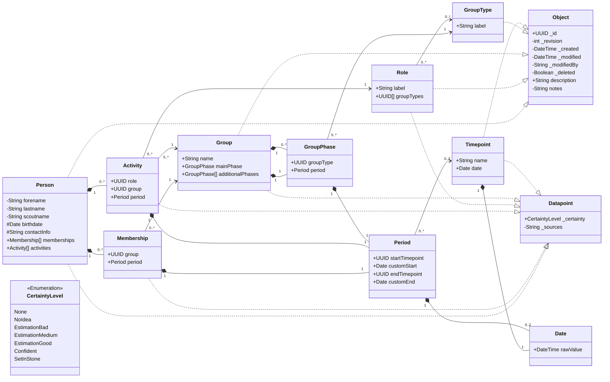

# Stammbaum der Vaganten

Web app for preserving and exploring the history of
[Stamm der Vaganten](http://stammdervaganten.de).

The project is fully focused on the PHP/JSON web application in `web/`. There
is no separate desktop/WPF app in this repository.

## Web App

- Plain HTML, CSS, and JavaScript.
- PHP 8 JSON API.
- Passkey-based authentication.
- Permission-aware public, private, and sensitive fields.
- Human-readable domain object JSON storage under `web/data/`.
- Runtime auth, cache, change, and lock files under `web/var/`.

## Deploy

Upload `web/` to a PHP 8 shared host and keep the included `.htaccess` files.
The app does not require Composer, a database, or a build step.

Configuration lives in `web/config/app.json`. See [web/README.md](web/README.md)
for passkey setup and hosting details.

## Data Model

The app stores scout-group history as JSON objects. People, groups, roles, group
types, and timepoints are independent objects linked by UUIDs; memberships,
activities, group phases, periods, and dates are embedded value objects.

Goals:

- Keep domain data readable, diffable, and easy to repair.
- Preserve object history through revisions.
- Use stable UUID references instead of copied names.
- Model incomplete historical data with notes, sources, partial dates, and
  certainty values.



## Domain Rules

- A person can have memberships in groups and activities with roles.
- A membership links one person to one group for a period.
- An activity links one person, one group, and one role for a period.
- A group has one main phase and can have additional phases.
- A group phase references one group type for a period.
- A role can be restricted to group types; an empty `groupTypes` list means
  unrestricted.
- Period boundaries can use named timepoints or custom dates.
- Reverse views, such as all members of a group, are derived from memberships
  and activities.
## Visibility
`+` -> Property is public (visible without login)
`-` -> Property is private (visible only to logged-in users with read access)
`#` -> Property is protected (visible only to logged-in users with the 'sensitive data' permission)

## Storage

Each instance of an object type is stored in a folder (according to the plural of its type name in kebab-case) under `web/data/`.
Folder names are usable as REST resource collections.

```text
web/data/
  people/{uuid}.json
  groups/{uuid}.json
  group-types/{uuid}.json
  roles/{uuid}.json
  timepoints/{uuid}.json
```

JSON files contain the type's fields directly, including inherited base fields.
Runtime state (such as auth files, generated cache data, change queues, and locks) lives under `web/var/` and is not canonical domain data.

## Versioning and Concurrency
Updates change the revision; if the stored object changed meanwhile, the API returns `409 Conflict`.
Previous versions are saved as `<id>_<revision>.json` before `<id>.json` is replaced.
Deletes are soft deletes using `_deleted: true`.
Objects use optimistic concurrency.

## Default Data
Default group types and roles are normal full UUID-backed objects
They are starting data and can be removed on a fresh install.

Group types:

- Stamm
- Meute
- Rudel
- Gilde
- Sippe
- Runde
- Kreis

Roles:

- Stammesführung
- Stellv. Stammesführung
- Kassenwart
- Stellv. Kassenwart*in
- Handkasse
- Meutenführung
- Meutenassistenz
- Rudelführung
- Sippenführung
- Gildensprecher*in
- Rundensprecher*in
- Kreisleitung

## Current Gaps

- The main tree visualization is not implemented yet.
- Automated tests are still missing.
- Search, validation, import/export, duplicate handling, and source tracking
  need more work.
- Partial dates and certainty need deeper UI support.
