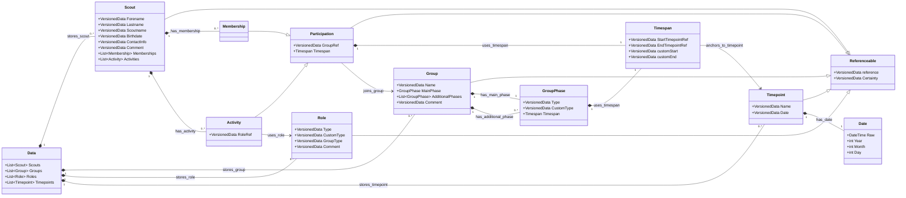
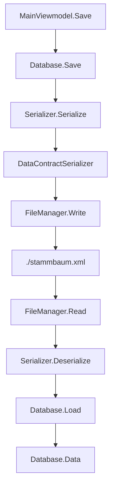
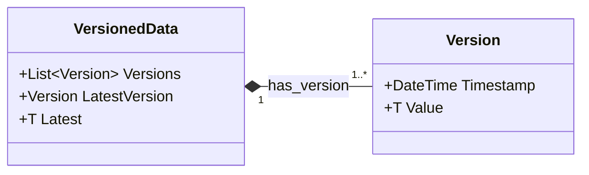

# Current Data Design

This document describes the current persisted data model implemented under
`StammbaumDerVaganten/Stammbaum`. It reflects the code as it exists now, not the
recommended future PHP/JSON design.

The current application stores one `Data` root object through
`DataContractSerializer` into `./stammbaum.xml`.

## High-Level Model



Diagram edges use semantic/property-graph style labels. Exact serialized
`DataMember` names are listed in the field tables below.

## Persistence Flow



Current persistence notes:

- The default file is `./stammbaum.xml`.
- `FileExtension.JSON` exists, but the active serializer is
  `DataContractSerializer`; the JSON serializer code is commented out.
- `Database.Save(bool humanReadable = true)` accepts a readability flag, but
  output formatting is currently commented out.
- `Database` itself is not a data contract. Only its `Data` field is serialized.
- `Log`, `FileManager`, `Serializer<T>`, and viewmodels are runtime helpers, not
  part of the persisted domain model.

## Core Serialization Wrappers

### `Reference<T>`

`Reference<T>` is the current relationship pointer type.

| Member | Serialized name | Type | Notes |
| --- | --- | --- | --- |
| `objectID` / `ObjectID` | `_RAW` | `int` | Stored numeric ID. Default invalid value is `-1`. |
| `context` / `Context` | not serialized | `Database` | Runtime-only database context used for lookup. |
| `NEXT_ID` | not serialized | static dictionary | Runtime ID counter per database context and generic reference type. |

Important implementation detail: `Reference<T>` does not currently implement
value equality by `ObjectID`. Existing lookups compare `Reference<T>` instances
directly, so relationships rely on shared reference objects, not only matching
numeric IDs.

### `Referenceable<TDerived>`

Common base for objects with an ID/reference.

Data contract name: `REF_{0}`.

| Member | Serialized name | Type | Notes |
| --- | --- | --- | --- |
| `reference` / `Reference` | `_REF` | `VersionedData<Reference<TDerived>>` | The object's own reference. |
| `Certainty` | `_CL` | `VersionedData<CertaintyLevel>` | Declared, but not initialized by default and not exposed in the UI. |

Used by:

- `Scout`
- `Group`
- `Role`
- `Timepoint`
- `Participation<TDerived>`
- therefore also `Membership` and `Activity`

### `VersionedData<T>`

Most scalar fields are wrapped in `VersionedData<T>`.

Data contract names:

- `VersionedData<T>`: `VD_{0}`
- nested `Version`: `_V`



| Member | Serialized name | Type | Notes |
| --- | --- | --- | --- |
| `Versions` | `_VERS` | `List<Version>` | Always initialized with one default version. |
| `Version.Timestamp` | `_T` | `DateTime` | Defaults to `DateTime.Now`. |
| `Version.Value` | `_VAL` | `T` | The stored value for that version. |

`Latest = value` appends a new version. `OverwriteLatestValue(value)` mutates
the newest version without adding history; constructors use this to initialize
test/demo objects.

### `Date`

`Date` wraps a `DateTime` and exposes `Year`, `Month`, and `Day` helpers.

Current caveat: `Date` is marked `[DataContract]`, but `Raw` is not marked
`[DataMember]`. With the current `DataContractSerializer` setup, the actual
date value is therefore not explicitly included in the serialized contract.

## Root Object

`Data` is the serialized root.

| Member | Serialized name | Type |
| --- | --- | --- |
| `Scouts` | `_SCOUTS` | `List<Scout>` |
| `Groups` | `_GROUPS` | `List<Group>` |
| `Roles` | `_ROLES` | `List<Role>` |
| `Timepoints` | `_TIMEPOINTS` | `List<Timepoint>` |

`Membership` and `Activity` are not top-level lists. They are embedded inside
each `Scout`.

## Domain Objects

### `Scout`

`Scout : Referenceable<Scout>`

| Member | Serialized name | Type |
| --- | --- | --- |
| inherited `reference` | `_REF` | `VersionedData<Reference<Scout>>` |
| inherited `Certainty` | `_CL` | `VersionedData<CertaintyLevel>` |
| `Forename` | `_FN` | `VersionedData<string>` |
| `Lastname` | `_LN` | `VersionedData<string>` |
| `Scoutname` | `_SN` | `VersionedData<string>` |
| `Birthdate` | `_BD` | `VersionedData<Date>` |
| `ContactInfo` | `_CI` | `VersionedData<string>` |
| `Comment` | `_C` | `VersionedData<string>` |
| `Memberships` | `_M` | `List<Membership>` |
| `Activities` | `_A` | `List<Activity>` |

Scout owns memberships and activities as embedded child records.

### `Group`

`Group : Referenceable<Group>`

| Member | Serialized name | Type |
| --- | --- | --- |
| inherited `reference` | `_REF` | `VersionedData<Reference<Group>>` |
| inherited `Certainty` | `_CL` | `VersionedData<CertaintyLevel>` |
| `Name` | `_N` | `VersionedData<string>` |
| `MainPhase` | `_MP` | `GroupPhase` |
| `AdditionalPhases` | `_AP` | `List<GroupPhase>` |
| `Comment` | `_C` | `VersionedData<string>` |

`GroupPhase` describes a group's type during a timespan.

| Member | Serialized name | Type |
| --- | --- | --- |
| `Type` | `_T` | `VersionedData<GroupType>` |
| `CustomType` | `_CT` | `VersionedData<string>` |
| `Timespan` | `_TSP` | `Timespan` |

`GroupType` values:

```text
None, Custom, Stamm, Meute, Rudel, Gilde, Sippe, Runde, Kreis
```

### `Role`

`Role : Referenceable<Role>`

| Member | Serialized name | Type |
| --- | --- | --- |
| inherited `reference` | `_REF` | `VersionedData<Reference<Role>>` |
| inherited `Certainty` | `_CL` | `VersionedData<CertaintyLevel>` |
| `Type` | `_T` | `VersionedData<RoleType>` |
| `CustomType` | `_CT` | `VersionedData<string>` |
| `GroupType` | `_GT` | `VersionedData<GroupType>` |
| `Comment` | `_C` | `VersionedData<string>` |

`Role.GroupType` expresses which group type a role can be held on.

`RoleType` values:

```text
None,
Custom,
Stammesfuehrung,
StellvStammesfuehrung,
Kassenwart,
StellvKassenwart,
Handkasse,
Meutenfuehrung,
Meutenassistenz,
Rudelfuehrung,
Sippenfuehrung,
Gildensprecher,
Rundensprecher,
Kreisleitung
```

### `Timepoint`

`Timepoint : Referenceable<Timepoint>`

| Member | Serialized name | Type |
| --- | --- | --- |
| inherited `reference` | `_REF` | `VersionedData<Reference<Timepoint>>` |
| inherited `Certainty` | `_CL` | `VersionedData<CertaintyLevel>` |
| `Name` | `_N` | `VersionedData<string>` |
| `Date` | `_D` | `VersionedData<Date>` |

`Timepoint.INVALID` is a runtime sentinel used by the UI for "no timepoint /
custom date". It is not part of `Data.Timepoints` unless explicitly added.

### `Participation<TDerived>`

Generic base for participation records.

| Member | Serialized name | Type |
| --- | --- | --- |
| inherited `reference` | `_REF` | `VersionedData<Reference<TDerived>>` |
| inherited `Certainty` | `_CL` | `VersionedData<CertaintyLevel>` |
| `GroupRef` | `_G` | `VersionedData<Reference<Group>>` |
| `Timespan` | `_TSP` | `Timespan` |

`Membership : Participation<Membership>` adds no fields.

`Activity : Participation<Activity>` adds:

| Member | Serialized name | Type |
| --- | --- | --- |
| `RoleRef` | `_R` | `VersionedData<Reference<Role>>` |

## Timespans And Timepoints

`Timespan` can either use named timepoints or custom dates.

| Member | Serialized name | Type | Meaning |
| --- | --- | --- | --- |
| `StartTimepointRef` | `_SP` | `VersionedData<Reference<Timepoint>>` | Named start point. |
| `EndTimepointRef` | `_EP` | `VersionedData<Reference<Timepoint>>` | Named end point. |
| `customStart` | `_S` | `VersionedData<Date>` | Fallback custom start date. |
| `customEnd` | `_E` | `VersionedData<Date>` | Fallback custom end date. |

Runtime accessors:

- `StartIsCustom()` returns true when `StartTimepointRef.Latest` is invalid.
- `EndIsCustom()` returns true when `EndTimepointRef.Latest` is invalid.
- `Start` and `End` resolve through `MainViewmodel.ActiveData` when a valid
  timepoint reference exists; otherwise they use the custom date fields.

## Certainty

`CertaintyLevel` exists but is not meaningfully used in the current UI.

```text
None = 0
NoIdea = 1
EstimationBad = 3
EstimationMedium = 4
EstimationGood = 5
Confident = 7
SetInStone = 9
```

It is declared in two places:

- `Referenceable<TDerived>.Certainty`
- `Datapoint<T>.Certainty`

`Datapoint<T>` is not marked `[DataContract]` and is not used by the current
domain classes.

## Current Implementation Caveats

These are data-design facts worth preserving for a rewrite or migration:

- References store only `_RAW` object IDs, while their `Database Context` is
  runtime-only and not serialized.
- `Reference<T>` does not implement value equality by `ObjectID`; current lookup
  code compares reference object instances directly.
- There is no visible relinking pass after deserialization to restore reference
  contexts or canonical shared reference instances.
- `Date.Raw` is not marked `[DataMember]`, so actual date values are not
  explicitly serialized by the current `Date` data contract.
- `Referenceable<TDerived>.Certainty` is declared but not initialized by default.
- `Membership`, `Activity`, and `Timespan` have placeholder `ToString()`
  implementations.
- There is no schema version, migration layer, validation layer, or automated
  test coverage for serialized data compatibility.
- The `humanReadable` save option currently has no effect because formatting is
  commented out.
