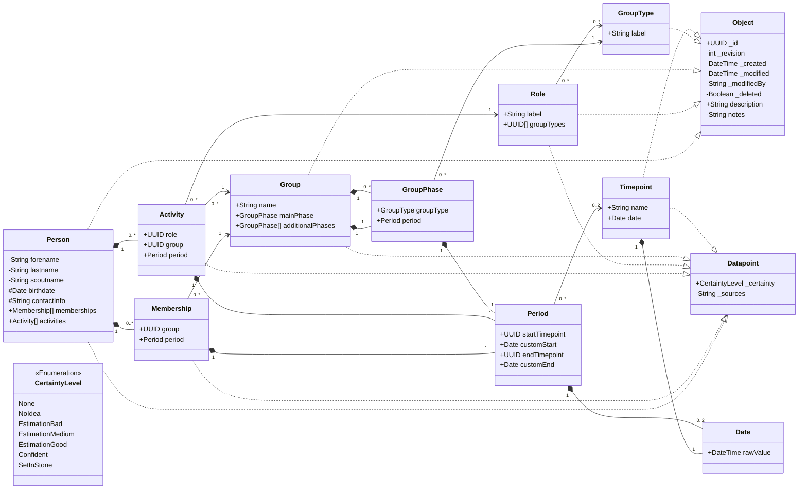

# Data model

## Visibility
`+` -> Property is public (visible to anyone)
`-` -> Property is private (visible only to users who are allowed to read data)
`#` -> Property is protected (visible only to users who are allowed to read senstive data)

Everyone can read public fields - this data can potentially be shown publicly (e.g. on a website).
Users with either read or write permission can receive public and private fields.
Sensitive fields are only included when the user also has the sensitive permission.

## Deletion
Deleted objects are hidden from normal object list responses and will be private (they are only accessible for users who are allowed to read data);
`_deleted` is written on the latest object JSON when an object is deleted.
The deletion timestamp and deleting user are represented by `_modified` and `_modifiedBy` on that delete revision.

# Versioning
Every class that implements `Object` is stored as a JSON object.
When a change to an object is committed, the revision number needs to be incremented by one.
The `_modified` property should reflect the timestamp of the latest change, the `_created` property reflects the timestamp of creation of the data object.
The latest version of an object is stored in a json file `<id>.json`.
Previous versions are stored next to the latest file as `<id>_<revision>.json`
before the latest file is replaced. Delete is implemented as a soft-delete
revision: the latest `<id>.json` remains present with `_deleted` set, while
normal list responses hide the object. The delete time and deleting user are the
delete revision's `_modified` and `_modifiedBy` values.

# JSON
The content of the object's JSON file will be the type's properties exactly as defined in the class diagram.
Properties from base classes will be part of the object's properties as if they would have been defined as part of the class itself.

# Folders
One folder per object child class type in kebab-case and plural of the type name (folder name should be usable as REST resource collection).
Object JSON files within those folders, see [Versioning](#versioning).

# Default (built-in) data
This data is available as a starting point.
Each of the listed item is a full object as defined by the class diagram.
Each object will use the respective value for the property mentioned in the header (in parantheses).

## Group Types (label)
- Stamm
- Meute
- Rudel
- Gilde
- Sippe
- Runde
- Kreis

## Roles (label)
- Stammesführung
- Stellv. Stammesführung
- Kassenwart
- Stellv. Kassenwart*in
- Handkasse
- Meutenführung
- Meutenassistenz
- Rudelführung
- Sippenführung
- Gildensprecher*in
- Rundensprecher*in
- Kreisleitung
