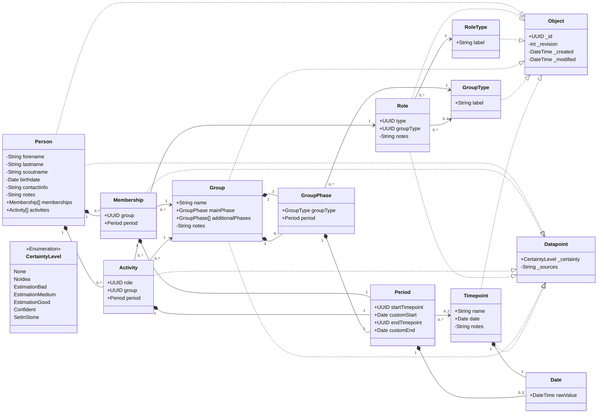

# Data model

## Visibility
`+` -> Property is public (visible to all users)
`-` -> Property is private (visible only to users who are allowed to see sensitive data)

# Versioning
Every class that implements `Object` is stored as a json object.
When a change to an object is getting commited, the revision number needs to be incremented by one.
The `modified` property should reflect the timestamp of the latest change, the `created` property reflects the timestamp of creation of the data object.
The latest version of an object is stored in a json file `<id>.json`.
If no version control software is used, then previous versions can be stored as `<id>_<revision>.json`.

# JSON
The content of the object's JSON file will be the types properties exactly as deinfed in the class diagram.
Properties from base classes will be part of the objec's properties as if they would have been defined as part of the class itself.

# Folders
One folder per object child class type in kebab-case and plural of the type name (folder name should be usable as REST resource collection).
Object JSON files within those folders, see [Versioning](#versioning).

# Default (built-in) data
This data is available as a starting point.
Each of the listed item is a full object as defined by the class diagram.
Each object will use the respective value for the property mentioned in the header (in parantheses).

## Group Types (label)
- Stamm
- Meute
- Rudel
- Gilde
- Sippe
- Runde
- Kreis

## Role Types (label)
- Stammesführung
- Stellv. Stammesführung
- Kassenwart
- Stellv. Kassenwart*in
- Handkasse
- Meutenführung
- Meutenassistenz
- Rudelführung
- Sippenführung
- Gildensprecher*in
- Rundensprecher*in
- Kreisleitung
