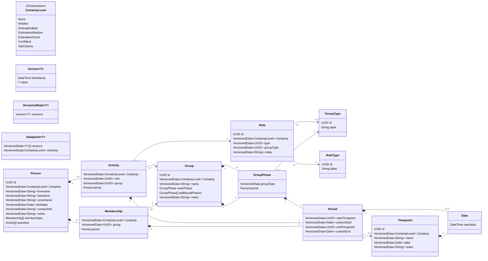

# Data model

# Default (built-in) data
## Group Types
- Stamm
- Meute
- Rudel
- Gilde
- Sippe
- Runde
- Kreis

## Role Types
- Stammesführung
- Stellv. Stammesführung
- Kassenwart
- Stellv. Kassenwart*in
- Handkasse
- Meutenführung
- Meutenassistenz
- Rudelführung
- Sippenführung
- Gildensprecher*in
- Rundensprecher*in
- Kreisleitung
