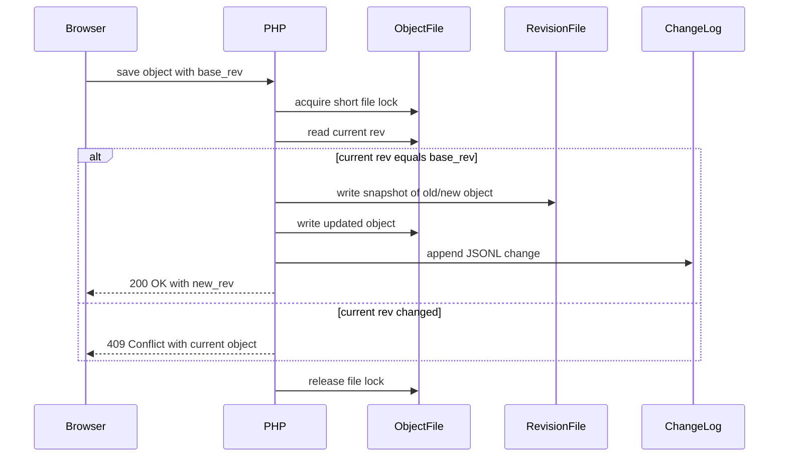
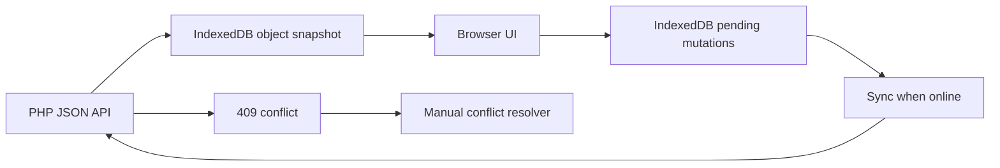

# Planned Web Data Design

This document describes the proposed data model for a future PHP/HTML/CSS/JS web
version. It is intentionally different from the current WPF/XML implementation:
the goal is human-readable object files, simple hosting, offline-capable browser
clients, and safe multi-user editing through revisions.

## Design Goals

- Run on ordinary PHP webhosting.
- Keep all important data in readable JSON files.
- Make backups, diffs, and manual repair straightforward.
- Support browser usage on all platforms.
- Support offline reading and queued offline edits.
- Allow concurrent editing through optimistic revisions and optional leases.
- Keep the domain model close to the scout-group history problem.

## Storage Layout

Use one JSON file per object plus append-only change logs.

```text
data/
  objects/
    people/{id}.json
    groups/{id}.json
    group-types/{id}.json
    group-phases/{id}.json
    roles/{id}.json
    timepoints/{id}.json
    memberships/{id}.json
    activities/{id}.json
    sources/{id}.json
    attachments/{id}.json
  revisions/
    people/{id}/{rev}.json
    groups/{id}/{rev}.json
    ...
  changes/
    2026-04.jsonl
  auth/
    users.json
  locks/
    {type}-{id}.json
  config/
    settings.json
```

Objects are addressed by stable string IDs. Use UUIDs generated either by the
browser or the PHP backend.

## Object Envelope

Every domain object should share a small metadata envelope.

```json
{
  "id": "018f2b5a-7d90-7c3b-9b74-b96a1e0e1b5a",
  "type": "person",
  "schema_version": 1,
  "rev": "0000000003-8c58b4d2",
  "created_at": "2026-04-28T12:00:00Z",
  "created_by": "user-admin",
  "updated_at": "2026-04-28T12:30:00Z",
  "updated_by": "user-admin",
  "deleted_at": null,
  "deleted_by": null,
  "visibility": "internal",
  "data": {}
}
```

| Field | Type | Notes |
| --- | --- | --- |
| `id` | string | Stable object ID. |
| `type` | string | Object collection/type name. |
| `schema_version` | int | Version of this object's JSON shape. |
| `rev` | string | Current object revision, required for conflict checks. |
| `created_at` | ISO timestamp | UTC. |
| `created_by` | user ID | User who created the object. |
| `updated_at` | ISO timestamp | UTC. |
| `updated_by` | user ID | User who last updated the object. |
| `deleted_at` | ISO timestamp or null | Soft delete marker. |
| `deleted_by` | user ID or null | User who deleted the object. |
| `visibility` | string | `public`, `internal`, `private`, or `restricted`. |
| `data` | object | Type-specific payload. |

Soft deletes are preferred over immediate file deletion so history and merges
remain understandable.

## Reference Rules

Canonical objects should store forward references only. Reverse relationships
are read models or generated indexes.

Required references:

- `group-phase.group_id` must reference an existing `group`.
- `group-phase.group_type_id` must reference an existing `group-type`.
- `membership.person_id` must reference an existing `person`.
- `membership.group_id` must reference an existing `group`.
- `activity.person_id` must reference an existing `person`.
- `activity.group_id` must reference an existing `group`.
- `activity.role_id` must reference an existing `role`.
- `attachment.source_id` must reference an existing `source`.

Optional references:

- `timespan.start.timepoint_id` and `timespan.end.timepoint_id` may reference
  existing `timepoint` objects.
- `source_ids` may appear on objects or value objects and should reference
  existing `source` objects.
- `role.allowed_group_type_ids` may reference zero or more `group-type` objects;
  an empty list means the role is not restricted by group type.

Validation should warn or reject an `activity` whose `role_id` is not allowed for
the selected group's active `group-type` during the activity's timespan.

## Common Value Objects

### Date Value

Historical data often has partial dates. Store date precision explicitly.

```json
{
  "value": "2008-05-06",
  "precision": "day",
  "display": "6. Mai 2008",
  "certainty": "confident",
  "source_ids": ["source-123"],
  "notes": ""
}
```

| Field | Type | Notes |
| --- | --- | --- |
| `value` | string or null | ISO-like value: `YYYY`, `YYYY-MM`, or `YYYY-MM-DD`. |
| `precision` | string | `none`, `year`, `month`, or `day`. |
| `display` | string | Optional human text when exact normalization is not enough. |
| `certainty` | string | See certainty levels below. |
| `source_ids` | string[] | Supporting sources. |
| `notes` | string | Optional explanation. |

### Timespan

Timespans can use direct dates, named timepoints, or both.

```json
{
  "start": {
    "date": { "value": "2008", "precision": "year" },
    "timepoint_id": null
  },
  "end": {
    "date": null,
    "timepoint_id": "timepoint-pfila-2012"
  },
  "certainty": "estimation_good",
  "notes": ""
}
```

If `timepoint_id` is set, the named timepoint is the preferred semantic anchor.
`date` may still be cached for easier display and offline use, but the timepoint
is authoritative.

### Localized Name

Simple string fields are enough for an MVP, but names benefit from structure.

```json
{
  "primary": "Phoenix",
  "aliases": ["Phoenix"],
  "sort_name": "phoenix"
}
```

## Domain Objects

### `person`

Path: `data/objects/people/{id}.json`

```json
{
  "id": "person-uuid",
  "type": "person",
  "schema_version": 1,
  "rev": "0000000001-abcd",
  "visibility": "internal",
  "data": {
    "forename": "Klaus",
    "lastname": "Heinz",
    "scout_name": "",
    "birth_date": {
      "value": "1985",
      "precision": "year",
      "certainty": "confident"
    },
    "contact": {
      "email": "",
      "phone": "",
      "address": "",
      "visibility": "private"
    },
    "notes": "",
    "source_ids": []
  }
}
```

Memberships and activities reference people by `person_id`; they are not embedded
inside the person object.

### `group`

Path: `data/objects/groups/{id}.json`

```json
{
  "id": "group-uuid",
  "type": "group",
  "schema_version": 1,
  "rev": "0000000001-abcd",
  "visibility": "public",
  "data": {
    "name": "Phoenix",
    "short_name": "",
    "notes": "",
    "source_ids": []
  }
}
```

Group type over time is stored in `group-phase` objects.

### `group-type`

Path: `data/objects/group-types/{id}.json`

```json
{
  "id": "group-type-uuid",
  "type": "group-type",
  "schema_version": 1,
  "rev": "0000000001-abcd",
  "visibility": "public",
  "data": {
    "key": "sippe",
    "label": "Sippe",
    "sort_order": 40,
    "color": "",
    "notes": "",
    "source_ids": []
  }
}
```

Group types are first-class reference data. Seed the system with common scout
types such as `Stamm`, `Meute`, `Rudel`, `Sippe`, `Runde`, and `Kreis`, but
refer to them by UUID from group phases and roles. The `key` is a stable
human-readable slug for imports and templates, not the primary identifier.

### `group-phase`

Path: `data/objects/group-phases/{id}.json`

```json
{
  "id": "group-phase-uuid",
  "type": "group-phase",
  "schema_version": 1,
  "rev": "0000000001-abcd",
  "visibility": "public",
  "data": {
    "group_id": "group-uuid",
    "group_type_id": "group-type-uuid",
    "timespan": {},
    "notes": "",
    "source_ids": []
  }
}
```

`group_type_id` references a `group-type` object. If users need another type,
they should create another `group-type` object and reference it here. The planned
canonical data model should not keep a parallel `custom_type` string field.

### `role`

Path: `data/objects/roles/{id}.json`

```json
{
  "id": "role-uuid",
  "type": "role",
  "schema_version": 1,
  "rev": "0000000001-abcd",
  "visibility": "public",
  "data": {
    "key": "stammesfuehrung",
    "label": "Stammesfuehrung",
    "allowed_group_type_ids": ["group-type-stamm-uuid"],
    "notes": "",
    "source_ids": []
  }
}
```

Roles are first-class reference data, matching the intent of the current WPF
implementation where `Role` is a referenceable object. Seed the system with
common roles such as `Stammesfuehrung`, `Kassenwart`, and `Sippenfuehrung`, but
refer to roles by UUID from activities. The `key` is a stable slug for imports
and templates, not the primary identifier.

### `timepoint`

Path: `data/objects/timepoints/{id}.json`

```json
{
  "id": "timepoint-uuid",
  "type": "timepoint",
  "schema_version": 1,
  "rev": "0000000001-abcd",
  "visibility": "public",
  "data": {
    "name": "Pfingstlager",
    "kind": "event",
    "date": {
      "value": "2012-06-01",
      "precision": "day",
      "certainty": "confident"
    },
    "notes": "",
    "source_ids": []
  }
}
```

### `membership`

Path: `data/objects/memberships/{id}.json`

```json
{
  "id": "membership-uuid",
  "type": "membership",
  "schema_version": 1,
  "rev": "0000000001-abcd",
  "visibility": "internal",
  "data": {
    "person_id": "person-uuid",
    "group_id": "group-uuid",
    "timespan": {},
    "notes": "",
    "source_ids": []
  }
}
```

### `activity`

Path: `data/objects/activities/{id}.json`

```json
{
  "id": "activity-uuid",
  "type": "activity",
  "schema_version": 1,
  "rev": "0000000001-abcd",
  "visibility": "internal",
  "data": {
    "person_id": "person-uuid",
    "group_id": "group-uuid",
    "role_id": "role-uuid",
    "timespan": {},
    "notes": "",
    "source_ids": []
  }
}
```

### `source`

Path: `data/objects/sources/{id}.json`

```json
{
  "id": "source-uuid",
  "type": "source",
  "schema_version": 1,
  "rev": "0000000001-abcd",
  "visibility": "internal",
  "data": {
    "title": "Interview mit ehemaliger Gruppenleitung",
    "kind": "interview",
    "date": {
      "value": "2026-04-28",
      "precision": "day"
    },
    "citation": "",
    "notes": ""
  }
}
```

Sources are optional for MVP data entry, but the model should reserve space for
them early because certainty and provenance are central to historical data.

### `attachment`

Path: `data/objects/attachments/{id}.json`

```json
{
  "id": "attachment-uuid",
  "type": "attachment",
  "schema_version": 1,
  "rev": "0000000001-abcd",
  "visibility": "restricted",
  "data": {
    "source_id": "source-uuid",
    "filename": "scan.jpg",
    "media_type": "image/jpeg",
    "storage_path": "files/attachments/attachment-uuid/scan.jpg",
    "sha256": "",
    "notes": ""
  }
}
```

## Seeded Reference Data

Group types and roles should be seeded as normal objects rather than hardcoded
strings or config-only values. This keeps them editable, referenceable, and
consistent with the rest of the model.

```json
{
  "seed": "bdp-like-defaults",
  "group_type_keys": ["stamm", "meute", "rudel", "sippe", "runde", "kreis"],
  "role_keys": [
    "stammesfuehrung",
    "kassenwart",
    "meutenfuehrung",
    "sippenfuehrung"
  ]
}
```

The seed file may help initial setup, but runtime data should live in
`data/objects/group-types/` and `data/objects/roles/`.

User extensions should also create normal objects. For example, a group-specific
type that did not exist in the seed should become a new `group-type` object, not
a local string on one group phase. Likewise, a new office or responsibility
should become a new `role` object.

## Certainty Levels

Use stable lowercase IDs for certainty values.

```text
none
unknown
estimation_bad
estimation_medium
estimation_good
confident
set_in_stone
```

Certainty can appear on:

- date values;
- timespans;
- full objects;
- specific future claim records, if the model later needs field-level history.

## Change Log And Revisions

Every successful write appends one JSON object line to the monthly change log.

```json
{
  "change_id": "change-uuid",
  "timestamp": "2026-04-28T12:30:00Z",
  "user_id": "user-editor",
  "operation": "update",
  "object_type": "person",
  "object_id": "person-uuid",
  "base_rev": "0000000001-abcd",
  "new_rev": "0000000002-ef01",
  "summary": "Updated scout name"
}
```



Revision files should contain complete object snapshots, not patches. Full
snapshots are larger but much easier to debug and restore.

## Locks And Leases

Locks are optional user-facing leases, not the primary data integrity mechanism.

Path: `data/locks/{type}-{id}.json`

```json
{
  "object_type": "person",
  "object_id": "person-uuid",
  "locked_by": "user-editor",
  "locked_at": "2026-04-28T12:25:00Z",
  "expires_at": "2026-04-28T12:35:00Z"
}
```

Use leases to warn users that someone else is editing an object. Always still
require `base_rev` checks on save.

## Auth And Rights

For simple hosting, user records can live in `data/auth/users.json`.

```json
{
  "schema_version": 1,
  "users": [
    {
      "id": "user-admin",
      "username": "admin",
      "display_name": "Admin",
      "password_hash": "...",
      "roles": ["admin"],
      "active": true,
      "created_at": "2026-04-28T12:00:00Z"
    }
  ]
}
```

Suggested roles:

| Role | Meaning |
| --- | --- |
| `admin` | Manage users, settings, backups, and all data. |
| `editor` | Create and edit historical data. |
| `viewer` | Read non-private data. |
| `private_data` | View sensitive fields such as contact details. |

Visibility rules should be enforced by the PHP API, not only by the frontend.

## Offline Client Store

The browser should store a local snapshot and queued mutations in IndexedDB.



Suggested IndexedDB stores:

| Store | Key | Purpose |
| --- | --- | --- |
| `objects` | `[type, id]` | Last synced object snapshot. |
| `pending_mutations` | `mutation_id` | Offline edits waiting for upload. |
| `conflicts` | `conflict_id` | Saves rejected by the server. |
| `sync_state` | key | Last successful sync metadata. |
| `reference_data` | key | Cached group type and role objects. |

Pending mutation shape:

```json
{
  "mutation_id": "mutation-uuid",
  "created_at": "2026-04-28T12:40:00Z",
  "operation": "update",
  "object_type": "person",
  "object_id": "person-uuid",
  "base_rev": "0000000002-ef01",
  "draft_object": {}
}
```

## Read Models And Indexes

The canonical data is the object files. For performance, PHP may build generated
indexes that can always be deleted and rebuilt.

```text
data/cache/
  search-index.json
  people-by-group.json
  activities-by-role.json
  timeline.json
```

These cache files must not be the only copy of any important information.

## Migration From Current WPF Model

Suggested mapping:

| Current WPF object | Planned web object |
| --- | --- |
| `Scout` | `person` |
| `Group` | `group` |
| `GroupType` enum value | seeded `group-type` object |
| `GroupType.Custom` with `GroupPhase.CustomType` | new `group-type` object |
| `Group.MainPhase` | `group-phase` |
| `Group.AdditionalPhases[]` | `group-phase` |
| `Role` | `role` |
| `RoleType.Custom` with `Role.CustomType` | new `role` object |
| `Timepoint` | `timepoint` |
| `Scout.Memberships[]` | `membership` |
| `Scout.Activities[]` | `activity` |
| `Timespan` | embedded `timespan` value object |
| `VersionedData<T>` | latest value first; historical values can become future change history |
| `CertaintyLevel` | lowercase certainty IDs |

During migration, preserve old numeric object IDs as `legacy_id` fields inside
`data` until all imported references have been verified.

## Open Design Decisions

- Whether to use UUID v4, UUID v7, or another sortable ID format.
- Whether source/provenance should be MVP functionality or added after core
  editing works.
- Whether field-level version history is needed immediately or whether object
  revision snapshots are enough.
- Whether attachments should be supported in the first web version.
- Whether a local event laptop should run the same PHP app locally or use a
  static offline-only mode with later import/export.
