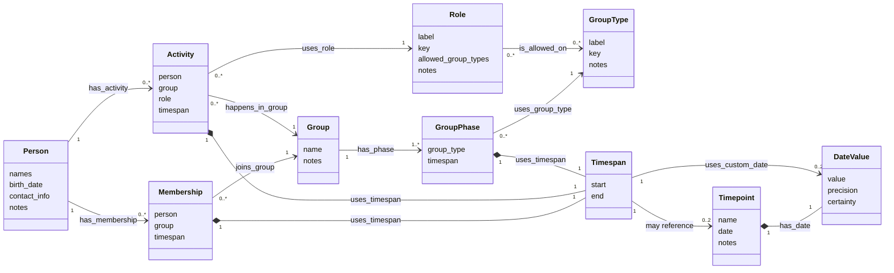

# Shared Data Concepts

This document captures the domain model that is common to both:

- the current WPF/XML implementation in `docs/data-design.md`;
- the planned PHP/JSON web design in `docs/planned-web-data-design.md`.

It is the implementation-independent model: the concepts the project should keep
even if storage, UI, serialization, and synchronization change.

## Core Idea

The project models the history of a scout group as a time-aware graph:

- people exist independently from their memberships and responsibilities;
- groups exist independently from their type at any one time;
- roles describe reusable offices or responsibilities;
- timepoints anchor historical facts to named events;
- memberships and activities connect people to groups and roles over time;
- dates can be exact, partial, estimated, or uncertain.

## Conceptual Model



Diagram edges are semantic/property-graph style: labels are verbs and arrow
direction is chosen to make the relationship read naturally. Implementation
documents may store the underlying references in a different direction.

## Shared Vocabulary

| Concept | Current implementation | Planned web design | Meaning |
| --- | --- | --- | --- |
| Person | `Scout` | `person` | A person/scout known to the group history. |
| Group | `Group` | `group` | A named organizational unit. |
| Group type | `GroupType` enum value | `group-type` object | A reusable classification for group phases. |
| Group phase | `GroupPhase` embedded in `Group` | `group-phase` object | A group's type during a timespan. |
| Role | `Role` | `role` | A reusable office or responsibility. |
| Timepoint | `Timepoint` | `timepoint` | A named event/date usable as a time anchor. |
| Membership | `Membership` embedded in `Scout` | `membership` object | A person belongs to a group for a timespan. |
| Activity | `Activity` embedded in `Scout` | `activity` object | A person holds a role in a group for a timespan. |
| Timespan | `Timespan` | embedded `timespan` value object | Start/end range using dates or timepoints. |
| Date | `Date` | `date` / `DateValue` | A date value, ideally with precision and certainty. |
| Reference | `Reference<T>` numeric object ID | string ID / UUID reference | Stable link between objects. |
| Certainty | `CertaintyLevel` | lowercase certainty IDs | Confidence in historical data. |
| History | `VersionedData<T>` | object revisions and change logs | Ability to preserve changes over time. |

## Common Domain Rules

- A person can have zero or more memberships.
- A person can have zero or more activities.
- A membership links exactly one person to exactly one group.
- An activity links exactly one person, one group, and one role.
- A group can have one main phase and optional additional phases conceptually;
  the planned web design stores all phases uniformly.
- A group phase references one group type for a timespan.
- A role is a reusable reference object and can be restricted to one or more
  group types.
- A role without group type restrictions can be treated as valid for any group
  type.
- A timespan can use custom dates, named timepoints, or a mix of both.
- Named timepoints prevent duplicating important dates across many records.
- Relationships should use stable IDs/references rather than copied names.
- Reverse views such as "all members of a group" should be derived from
  membership/activity records instead of stored as duplicate canonical data.

## Shared Data Quality Needs

Both designs need to support historical data that is incomplete or uncertain.

Important shared requirements:

- partial dates, such as year-only or month-only dates;
- uncertain or estimated dates;
- notes/comments on most domain objects;
- stable references that survive renames;
- some form of change history;
- future migration path for better provenance/source tracking.

## Shared Group Type Concept

Both designs assume scout-specific group types while allowing user-defined
extensions.

Common examples:

```text
Stamm
Meute
Rudel
Gilde
Sippe
Runde
Kreis
```

The current implementation stores these as an enum and uses `Custom` plus a
separate text field as an extension escape hatch. The planned web design should
replace that with UUID-backed `group-type` objects so other groups can adapt the
model without turning relationships into fragile strings.

## Shared Role Concept

Both designs treat roles as reusable definitions, not as one-off text fields on
activities.

Common examples:

```text
Stammesfuehrung
StellvStammesfuehrung
Kassenwart
StellvKassenwart
Handkasse
Meutenfuehrung
Meutenassistenz
Rudelfuehrung
Sippenfuehrung
Gildensprecher
Rundensprecher
Kreisleitung
```

The current implementation already stores `Role` as a referenceable object with
its own ID; only the built-in role kind is an enum, with `Custom` plus a text
field as an extension escape hatch. The planned web design should preserve the
referenceable role concept and represent user-defined roles as normal UUID-backed
role objects with labels and allowed group type references.

## Shared Certainty Concept

The current implementation already contains certainty levels, and the planned
web design should keep that idea.

Conceptual certainty scale:

```text
none
unknown
bad estimate
medium estimate
good estimate
confident
set in stone
```

Certainty should eventually be usable on dates, timespans, and possibly
individual claims.

## Implementation Differences Not Shared

These are intentionally not part of the shared model:

- WPF viewmodels and UI controls;
- `DataContractSerializer` and XML field names;
- PHP API routes;
- JSON file layout;
- IndexedDB offline queue shape;
- object lock files;
- auth/users/roles for application access;
- generated cache/index files.

Those belong in the implementation-specific design documents.
